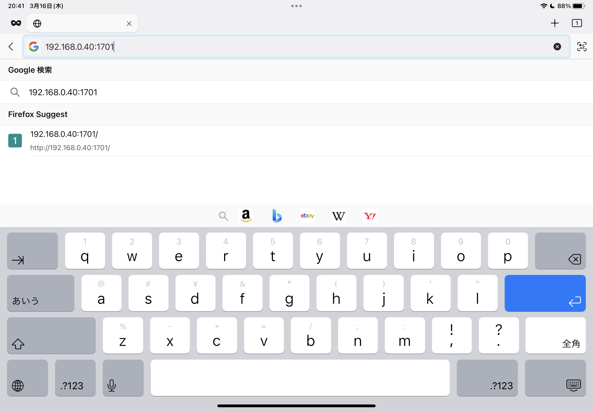

# Windows-iPad-Weylus

WeylusをWindows＋iPadで利用する手順

---

# インストール（Windows）

1. `Windows.zip` をダウンロードする。

- [H-M-H/Weylus](https://github.com/H-M-H/Weylus)
  - [Releases](https://github.com/H-M-H/Weylus/releases)

2. `Windows.zip` を解凍する。

# 実行（Windows）

1. `weylus.exe` を実行する。

2. ウィンドウが開いたら、 `Start` をクリックする。
3.

1. Windows ファイアウォールのダイアログが開いた場合は、 `パブリック ネットワーク` のチェックをつけて `アクセスを許可する` をクリックする。

2. コマンドプロンプト等で `ipconfig` を実行し、IPアドレスを確認する。

# 実行（iPad）

1. ブラウザで "http://" + ＜Win機のIPアドレス＞ + ":1701" を開く。

2. Settings パネルを閉じる。

# 動作確認（Win）

1. Whiteboard（Paintなどなんでもよい）を開く。

# 動作確認（iPad）

1. タッチパネルから入力する。

---

Copyright (c) 2023 YA-androidapp(https://github.com/YA-androidapp) All rights reserved.
